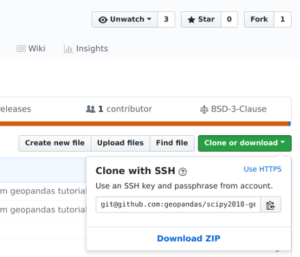

# Scipy 2018 Tutorial - Introduction to Geospatial Data Analysis with Python 

[](https://mybinder.org/v2/gh/geopandas/scipy2018-geospatial-data/master)

### Instructors

- [Levi John Wolf](https://ljwolf.org) - [University of Bristol](http://www.bristol.ac.uk/geography/levi-j-wolf/overview.html)
- Sergio Rey - [Center for Geospatial Sciences, University of California, Riverside](http://spatial.ucr.edu/peopleRey.html)
- [Dani Arribas-Bel](http://darribas.org/) -  University of Liverpool
- [Joris Van den Bossche](https://jorisvandenbossche.github.io/) - Université Paris-Saclay Center for Data Science 


This tutorial is an introduction to geospatial data analysis in Python, with a focus on tabular vector data. It is the first part in a series of two tutorials; this part focuses on introducing the participants to the different libraries to work with geospatial data and will cover munging geo-data and exploring relations over space. This includes importing data in different formats (e.g. shapefile, GeoJSON), visualizing, combining and tidying them up for analysis, and will use libraries such as `pandas`, `geopandas`, `shapely`, `PySAL`, or `rasterio`. The second part will built upon this and focus on more more advanced geographic data science and statistical methods to gain insight from the data. No previous experience with those geospatial python libraries is needed, but basic familiarity with geospatial data and concepts (shapefiles, vector vs raster data) and pandas will be helpful.


## Installation notes

Following this tutorial will require recent installations of:

- Python >= 3.5 (it will probably work on python 2.7 as well, but I didn't test it specifically)
- pandas
- geopandas >= 0.3.0
- matplotlib
- rtree
- PySAL
- cartopy
- geoplot
- [Jupyter Notebook](http://jupyter.org)

If you do not yet have these packages installed, I recommend to use the [conda](http://conda.pydata.org/docs/intro.html) package manager to install all the requirements 
(you can install [miniconda](http://conda.pydata.org/miniconda.html) or install the (larger) Anaconda
distribution, found at https://www.anaconda.com/download/).

Once this is installed, the following command will install all required packages in your Python environment:

```
conda install jupyter geopandas geoplot
```

But of course, using another distribution (e.g. Enthought Canopy) or ``pip`` is fine as well (a requirements file is provided as well), as long
as you have the above packages installed.


## Downloading the tutorial materials

**Note**: I am still updating the materials, so I recommend to only download the materials on Monday morning before the tutorial starts (or to update your local copy then).

If you have git installed, you can get the tutorial materials by cloning this repo:

    git clone https://github.com/jorisvandenbossche/geopandas-tutorial.git

Otherwise, you can download the repository as a .zip file by heading over
to the GitHub repository (https://github.com/jorisvandenbossche/geopandas-tutorial) in
your browser and click the green "Download" button in the upper right:



I will probably make some changes until the start of the tutorial, so best to download
the latest version then (again), or do a `git pull` if you are using git.

